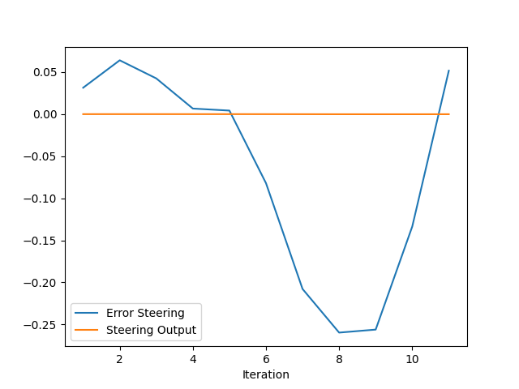

# Control and Trajectory Tracking for Autonomous Vehicle
<hr><br>


_Screenshot of initial simulator run._

# Proportional-Integral-Derivative (PID)
<hr><br>

This project demonstrates the iterative design as well as automatic parametric optimization of two PID controllers, one for steering and another for throttle, to keep the autonomous vehicle in the desired path. The car and environment are simulated through CARLA simulator.
<hr><br>

## Code
<hr><br>

The PID controller class files and main function can be found in the [pid_controller](./project/pid_controller/) folder. Refer to [README](./README.md) for local installation.
<hr><br>

## Building the PID controller object
<hr><br>

[pid_controller.cpp](./project/pid_controller/pid_controller.cpp) and [pid_controller.h](./project/pid_controller/pid_controller.h).

We add a sixth argument called `twidi` to toggle Twiddle optimization.
```cpp
    void Init(double Kp, double Ki, double Kd, double output_lim_max, double output_lim_min, int twidi);
```
The implementation of the Twiddle algorithm is embedded in the `UpdateError()` function, which serves as the discretized integrator and derivator of cross-track error over delta t. Twiddle is also known as "coordinate ascent" parametric optimization.
```cpp
void PID::UpdateError(double cte) {
   /**
   * TODO: Update PID errors based on cte.
   **/

// Twiddle algorithm:
    if (twid == 1 && ((dp.at(0) + dp.at(1) + dp.at(2)) > 0.0002)) {
        if (flag == 0) {
            int _cte = cte * cte;
            p.at(index) += dp.at(index);
            if (_cte < best_cte) {
                best_cte = _cte;
                dp.at(index) *= 1.1;
                index+=1;
                if (index > 2) {
                    index = 0;
                }
            } else {
                p.at(index) -= 2*dp.at(index);
                flag = 1;
            }
        } else if (flag == 1) {
            int _cte = cte * cte;
            if (_cte < best_cte) {
                best_cte = _cte;
                dp.at(index) *= 1.1;
            } else {
                p.at(index) += dp.at(index);
                dp.at(index) *= 0.9;
            }
            index+=1;
            if (index > 2) {
                index = 0;
            }
            flag = 0;
        }
        Kp = p.at(0);
        Ki = p.at(1);
        Kd = p.at(2);
        cout << "Kp: " << Kp << endl;
        cout << "Ki: " << Ki << endl;
        cout << "Kd: " << Kd << endl;
        cout << "Sol: " << dp.at(0) + dp.at(1) + dp.at(2) << endl << endl;
    }


    if (dt > 0) {
        diff_cte = (cte - prev_cte) / dt;
    } else {
        diff_cte = 0.0;
    }
    prev_cte = cte;
    int_cte += (cte * dt);
```

## Adapting the PID controller to the simulation
<hr><br>

To perform our Proportional-Integral-Derivative control, we measure the cross-track error in each dt. For  steering cte, we derive the yaw angle between the last two points of our desired trajectory:
```cpp
          // STUDENT EXPLANATION FOR COMPUTING STEER ERROR:
          //
          // Get the yaw angle (arctan) of trajectory between last two points,
          // then subtract desired yaw and actual yaw.
          if (x_points.size() > 1) {
              error_steer = angle_between_points(x_points[x_points.size()-2],
                                                 y_points[y_points.size()-2],
                                                 x_points[x_points.size()-1],
                                                 y_points[y_points.size()-1]) - yaw;
          } else {
              error_steer = 0;
          }
```
For throttle cte, we simply subtract desired velocity and actual velocity:
```cpp
          // STUDENT EXPLANATION FOR COMPUTING THROTTLE ERROR:
          //
          // Last point of v_points is desired velocity.
          // Throttle error is the difference between desired and actual velocity.
          error_throttle = v_points.back() - velocity;
```
Iterative (non-automatic) testing resulted in the following PID coefficients:
```cpp
  // initialize pid steer
  /**
  * TODO (Step 1): create pid (pid_steer) for steer command and initialize values
  **/
  PID pid_steer = PID();
  pid_steer.Init(0.3, 0.001, 0.1, 1.2, -1.2, 1); // Last Good: 0.3, 0.001, 0.1
```
```cpp
  // initialize pid throttle
  /**
  * TODO (Step 1): create pid (pid_throttle) for throttle command and initialize values
  **/
  PID pid_throttle = PID();
  pid_throttle.Init(0.1, 0.01, 0.005, 1, -1, 1); // Last good: 0.1, 0.01, 0.005 Last Twiddle: 0.111359, 0.0146669, 0.005
```
Results of parametric optimization are recorded on the side.

## Evaluation and analysis of the PID controller
<hr><br>

## Isolate Throttle PID

To begin our iterative testing, we must consider that there are two PID controllers which influence each other. We first isolate the more complex of the two which is steering and set its coefficients to an approximation of 0 (otherwise the Udacity framework returns an error). We can then test an isolated throttle PID.

## Throttle P

We will proceed in P-I-D order for throttling. We start with P and set I and D to `0.0000000001`.
```cpp
pid_throttle.Init(0.1, 0.0000000001, 0.0000000001, 1, -1, 0); // set last argument to 1 for Twiddle
pid_steer.Init(0.0000000001, 0.0000000001, 0.0000000001, 1.2, -1.2, 0); // zero the steer
```
Only consider the first 10 iterations of the following for P-throttle:
<table>
	<tr>
		<td></td>
		<td></td>
	</tr>
</table>

We choose this P value because going beyond `0.1` results in sudden overshooting. A higher amount is good for correcting an initial high cte as fast as possible, but it will leave high errors in the next iterations (which we need to stabilize with I and D values later on).

## Throttle I

Now for I throttle:
```cpp
pid_throttle.Init(0.1, 0.01, 0.0000000001, 1, -1, 0); // set last argument to 1 for Twiddle
pid_steer.Init(0.0000000001, 0.0000000001, 0.0000000001, 1.2, -1.2, 0); // zero the steer
```
Comparing the first 10 iterations of the result below from just Throttle P above, we can see that the error from iteration 6 to 10 was smoothed down, which is what Integration should do as it is correcting for the sum of the errors over time.

<table>
	<tr>
		<td></td>
		<td></td>
	</tr>
</table>

## Throttle D

For throttle D, we get an even faster total correction.
```cpp
pid_throttle.Init(0.1, 0.01, 0.005, 1, -1, 0); // set last argument to 1 for Twiddle
pid_steer.Init(0.0000000001, 0.0000000001, 0.0000000001, 1.2, -1.2, 0); // zero the steer
```
We are only using a relatively small Derivative coefficient. D concerns mostly high frequency errors by definition of the derivative, and for a constant 3m/s cruise a higher amount will only manifest in high frequency oscillations.

<table>
	<tr>
		<td></td>
		<td></td>
	</tr>
</table>

We can clearly see a smoothing effect over the high frequency parts of the curve.

## Steering PID

Now that we have a decent throttle PID controller that lets us cruise at a constant 3m/s, this will minimize errors as we tweak our more complex steering PID.

## Steering P

It is harder to see improvements just by looking at the graph compared to the simpler cruise throttle, as we have to make a lot of yaw changes to avoid obstacles.

```cpp
pid_throttle.Init(0.1, 0.01, 0.005, 1, -1, 0); // set last argument to 1 for Twiddle
pid_steer.Init(0.3, 0.0000000001, 0.0000000001, 1.2, -1.2, 0); // zero the steer
```

The steering P value was chosen to be the most stable at avoiding the first vehicle. Compared to throttle P, we have a higher steering P that reflects immediate response to direction change.

<table>
	<tr>
		<td></td>
		<td></td>
	</tr>
</table>

## Steering I

We can notice that we have a much lower steering I than throttle I. This is because our error fluctuates at a high frequency around zero, from positive to negative, and the resulting integral over the area would approach zero, thus minimizing the effect of I.

```cpp
pid_throttle.Init(0.1, 0.01, 0.005, 1, -1, 0); // set last argument to 1 for Twiddle
pid_steer.Init(0.3, 0.001, 0.0000000001, 1.2, -1.2, 0); // zero the steer
```

<table>
	<tr>
		<td></td>
		<td></td>
	</tr>
</table>

## Steering D

Now we see a much higher value of steering D compared to throttle D as expected of the high frequency of yaw changes.

```cpp
pid_throttle.Init(0.1, 0.01, 0.005, 1, -1, 0); // set last argument to 1 for Twiddle
pid_steer.Init(0.3, 0.001, 0.1, 1.2, -1.2, 0); // zero the steer
```

<table>
	<tr>
		<td></td>
		<td></td>
	</tr>
</table>

It is still hard to see an improvement just by looking at the graph, but this configuration allows us to keep track of the trajectory much longer and avoiding obstacles.
<hr><br>

## Answers to given questions:
<hr><br>

### Q: Add the plots to your report and explain them (describe what you see)

A: *Answered in previous section.*
<br>

### Q: What is the effect of the PID according to the plots, how each part of the PID affects the control command?

A: *Answered in previous section.*
<br>

### Q: How would you design a way to automatically tune the PID parameters?

A: *Answered in next section.*
<br>

### Q: PID controller is a model free controller, i.e. it does not use a model of the car. Could you explain the pros and cons of this type of controller?

A: The model free controller used in this project only requires one variable: the cross-tracking error. This means that I can simply feed it the difference between a desired value and an actual measurement, and I will be able to control a system towards a desired trajectory. However, we still have to test for the proper values of three coefficients for Proportion, Integration, and Derivative, and doing it manually is a laborious endeavor. (However, there are optimization techniques which can automate parametrization, such as coordinate ascent.)
<br>

### Q: (Optional) What would you do to improve the PID controller?

A: As we've experienced in this project, it is extremely hard to get a PID controller to achieve perfect trajectory given different domains, i.e. a system that works for higher frequency domains like urban driving throttle may not work as well with relatively stable ones like freeway cruising. A system with a method of determining such domains and a PID controller for each domain would be a much more robust general solution.

<hr><br>

## Automatic tuning of PID parameters
<hr><br>

As discussed in the [Code](#code) section of this document, this project includes automatic parametrization using a C++ implementation of the Twiddle algorithm introduced by Sebastian Thrun:
```cpp
// A Twiddle algorithm implementation
    if (twid == 1 && ((dp.at(0) + dp.at(1) + dp.at(2)) > 0.0002)) {
        if (flag == 0) {
            int _cte = cte * cte;
            p.at(index) += dp.at(index);
            if (_cte < best_cte) {
                best_cte = _cte;
                dp.at(index) *= 1.1;
                index+=1;
                if (index > 2) {
                    index = 0;
                }
            } else {
                p.at(index) -= 2*dp.at(index);
                flag = 1;
            }
        } else if (flag == 1) {
            int _cte = cte * cte;
            if (_cte < best_cte) {
                best_cte = _cte;
                dp.at(index) *= 1.1;
            } else {
                p.at(index) += dp.at(index);
                dp.at(index) *= 0.9;
            }
            index+=1;
            if (index > 2) {
                index = 0;
            }
            flag = 0;
        }
```

Here is a video of this algorithm during training:


You can notice the updating P I D parameter values on the console in the background. And while it is not perfect, it does a decent job of reaching that far with very little training.

The given CARLA environment is not conducive to training due to the obstacles. One workaround is to disable the following lines in [/project/simulatorAPI.py](./project/simulatorAPI.py) to remove the other vehicles:

```py
batch.append(SpawnNPC(client, world, args, 30, 1.5))
batch.append(SpawnNPC(client, world, args, 65, -3 *1.5))
batch.append(SpawnNPC(client, world, args, 110, -1 * 1.5))
```